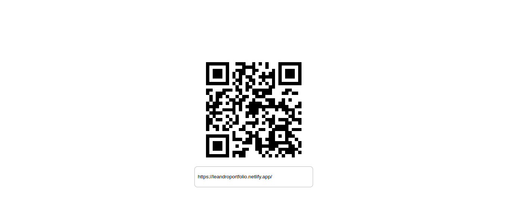

# Qrcode React

qrcode generator

## About the project

This project consists to create a qrcode generator

## Project demo

Photo

Final result: https://qrcodereact.netlify.app/

## Project's goal

Project developed to train React Hooks

## Technologies Used in the Project

Project made using the following languages/technologies:

* React Hooks

## installation

In order for this project to run on your machine, follow the steps below:

Clone this repository into a folder on your machine  
$ git clone https://github.com/Leveditor/Movie2.0.git  

Enter the folder
$ cd Movie2.0  

Install the dependencies by typing in the terminal:  
$ npm install  

Run the application in development mode:  
$ npm start

You must open port http://localhost:3000 in your browser to see the project.
